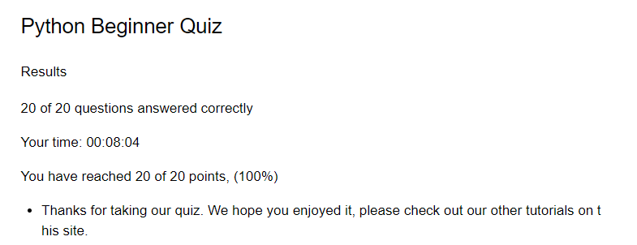
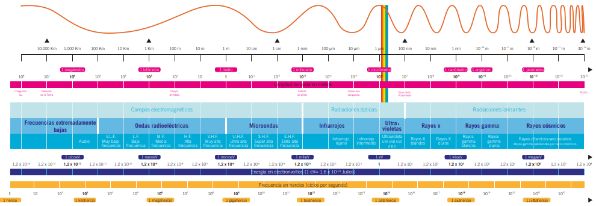

# El comienzo
## Como integrantes estan:
Juan Andres Valderrama Parra, Alias: AnonymusconH 

Miguel Angel Acevedo Olaya, Alias: Mickey

## LOGO:


## VIDEO DE YOUTUBE

https://www.youtube.com/watch?v=yaujGEe53JQ Deja tu like =)


### Punto 1: El inicio del fin

Resultado quiz python:



### Punto 2: Nuestro primer hackeo

Se le pide al usuario que ingrese los numeros que desea colocar, y establecer un codigo if en el que busque cual de los números reales es mayor
```
a=float(input("Ingresa tu primer número: "))
b=float(input("Ingresa tu segundo número: "))
c=float(input("Ingresa tu tercer número: "))

#Es necesario que no sean iguales, por eso utilizaremos el simbolo !

if a!=b and a!=b and b!=c:
    if a>b:
        if a>c:
            print("El numero mayor es:",a)
        else:
            print ("El número mayor es: ",c)
    else:
        if b>c:
            print("El número mayor es: ",b)
        else:
            print("El número mayor es: ",c)
else:
    print("Ingrese otros 3 números porque F, no se puede saber cual es mayor a cual xd")
```
### Punto 3: De momento esta muy facil =)

Se le pide al usuario que ingrese un número entero y si su residuo al dividirlo entre 2 es 0, es par, y si da 1 es un número impar.

```
print("vamo a ve si el número que proporcionas es par o impar >:)")
n=int(input("Ingresa el numero que quieras >:)))) : "))

if n % 2 ==0:
    print("Pillado, ese numerito como que es par >:)")
else:
    print("Suave, tu número es impar xd")

```

### Punto 4: En proceso, aun no hay sufrimiento

Se le pide al usuario que ingrese los números que desee, y establecer un condicional if en el que si el residuo de la división del numero a entre el número b es 0, a si es multiplo de b, y en caso tal que no de 0, no lo sera.

```
print("Vamo a ve si los números que coloques son multiplos uno del otro")

a=int(input("Coloca un primer número: "))
b=int(input("Coloca un segundo número: "))

if a % b == 0:
    print(f"{a} Es multiplo de {b}")

else:
    print(f"{a} NO es multiplo de {b}")
```

## PUNTO 5: Ya comienza la bueno

Realice un programa que lea tres números reales y determine si la suma de los dos primeros es mayor, menor o igual que el tercer número.

Se le pide al usuario que ingrese los 3 números que desee, y si establece un codigo if else, que estbalezca si la suma de los dos primeros es mayor,igual o menor y asi imprimir de acuerdo a lo que sea.

```
print("Vamos a ver si la suma de los primeros numeros que pongas serán mayor al tercero >:)")

a=float(input("Ingresa tu primer número: "))
b=float(input("Ingresa tu segundo número: "))
c=float(input("Ingresa tu tercer número: "))

if (a+b)>c:
    print("La suma de los primeros números dos son mayores al tercero")
elif (a+b)==c:
    print("La suma de los primeros dos número es igual al tecero")
else:
    print("La suma de los primeros dos números no es igual al tercero")

```
### Punto 6: ¿Vocal? ¿Consonante? Yo que se, quiero ver la champions

Se le pide al usuario que ingrese una letra a gusto, y se establece un condicional que determine si es vocal o no

```

print("Vamos a ver si el caracter que ingreses sera una vocal o consonante")
x= input("Coloca la letra que desees: ")

def vocal_o_consonante(x):
    if x in ("a", "A", "e","E","i","I","o","O","u","U","á","é","í","ó","ú"):
        print("Ingresaste una vocal")
    else:
        print("Ingresaste una consonante ")

print (vocal_o_consonante(x))
```


### Punto 7: 3 Horas de sufrimiento

#### Escriba un programa que pida 5 números reales y calcule las siguientes operaciones:

*   El promedio
*   La mediana
*   El promedio multiplicativo (multilplica todos y luego calcula la raíz de la cantidad de operandos)
*   Ordenar los números de forma ascendente
*   Ordenar los números de forma descendente
*   La potencia del mayor número elevado al menor número
*   La raíz cúbica del menor número

Antes de empezar con los puntos primero le pedimos al usuario que ingrese 5 números que esten dentro de los reales, en este caso decimales pueden incluirse

```
numero_1= float(input("Primer Número: "))
numero_2= float(input("Segundo Número: "))
numero_3= float(input("Tercero Número: "))
numero_4= float(input("Cuarto Número: "))
numero_5= float(input("Quinto Número: "))

```

#### PROMEDIO

Para el promedio en un primer paso deberan sumarse los 5 números

```
suma_numeros= float(numero_1+numero_2+numero_3+numero_4+numero_5)
print(suma_numeros)

```

Ahora la suma debera divirse entre el numero de datos, en este caso 5

```
promedio= float(suma_numeros/5)
print("promedio es igual a " +str(promedio))

```

#### La mediana

Para hallar la mediana deberemos encontrar el dato del medio por lo que estableceremos una structura if else en la que tratara de encontrar el dato del medio


```
if numero_2>numero_3>numero_1>numero_4>numero_5:
  print("Le mediana es " +str(numero_1))
elif numero_2>numero_3>numero_1>numero_5>numero_4:
  print("Le mediana es " +str(numero_1))
elif numero_3>numero_2>numero_1>numero_4>numero_5:
  print("Le mediana es " +str(numero_1))
elif numero_3>numero_2>numero_1>numero_5>numero_4:
  print("Le mediana es " +str(numero_1))
elif numero_2>numero_4>numero_1>numero_3>numero_5:
  print("Le mediana es " +str(numero_1))
elif numero_2>numero_4>numero_1>numero_5>numero_3:
  print("Le mediana es " +str(numero_1))
elif numero_4>numero_2>numero_1>numero_3>numero_5:
  print("Le mediana es " +str(numero_1))
elif numero_4>numero_2>numero_1>numero_5>numero_3:
  print("Le mediana es " +str(numero_1))
elif numero_2>numero_5>numero_1>numero_3>numero_4:
  print("Le mediana es " +str(numero_1))
elif numero_2>numero_5>numero_1>numero_4>numero_3:
  print("Le mediana es " +str(numero_1))
elif numero_5>numero_2>numero_1>numero_3>numero_4:
  print("Le mediana es " +str(numero_1))
elif numero_5>numero_2>numero_1>numero_4>numero_3:
  print("Le mediana es " +str(numero_1))
elif numero_3>numero_4>numero_1>numero_2>numero_5:
  print("Le mediana es " +str(numero_1))
elif numero_3>numero_4>numero_1>numero_5>numero_2:
  print("Le mediana es " +str(numero_1))
elif numero_4>numero_3>numero_1>numero_2>numero_5:
  print("Le mediana es " +str(numero_1))
elif numero_4>numero_3>numero_1>numero_5>numero_2:
  print("Le mediana es " +str(numero_1))
elif numero_3>numero_5>numero_1>numero_2>numero_4:
  print("Le mediana es " +str(numero_1))
elif numero_3>numero_5>numero_1>numero_4>numero_2:
  print("Le mediana es " +str(numero_1))
elif numero_5>numero_3>numero_1>numero_2>numero_4:
  print("Le mediana es " +str(numero_1))
elif numero_5>numero_3>numero_1>numero_4>numero_2:
  print("Le mediana es " +str(numero_1))
elif numero_4>numero_5>numero_1>numero_2>numero_3:
  print("Le mediana es " +str(numero_1))
elif numero_4>numero_5>numero_1>numero_3>numero_2:
  print("Le mediana es " +str(numero_1))
elif numero_5>numero_4>numero_1>numero_2>numero_3:
  print("Le mediana es " +str(numero_1))
elif numero_5>numero_4>numero_1>numero_3>numero_2:
  print("Le mediana es " +str(numero_1))
elif numero_1>numero_3>numero_2>numero_4>numero_5:
  print("Le mediana es " +str(numero_2))
elif numero_1>numero_3>numero_2>numero_5>numero_4:
  print("Le mediana es " +str(numero_2))
elif numero_3>numero_1>numero_2>numero_4>numero_5:
  print("Le mediana es " +str(numero_2))
elif numero_3>numero_1>numero_2>numero_5>numero_4:
  print("Le mediana es " +str(numero_2))
elif numero_1>numero_4>numero_2>numero_3>numero_5:
  print("Le mediana es " +str(numero_2))
elif numero_1>numero_4>numero_2>numero_5>numero_3:
  print("Le mediana es " +str(numero_2))
elif numero_4>numero_1>numero_2>numero_3>numero_5:
  print("Le mediana es " +str(numero_2))
elif numero_4>numero_1>numero_2>numero_5>numero_3:
  print("Le mediana es " +str(numero_2))
elif numero_1>numero_5>numero_2>numero_3>numero_4:
  print("Le mediana es " +str(numero_2))
elif numero_1>numero_5>numero_2>numero_4>numero_3:
  print("Le mediana es " +str(numero_2))
elif numero_5>numero_1>numero_2>numero_3>numero_4:
  print("Le mediana es " +str(numero_2))
elif numero_5>numero_1>numero_2>numero_4>numero_3:
  print("Le mediana es " +str(numero_2))
elif numero_3>numero_4>numero_2>numero_1>numero_5:
  print("Le mediana es " +str(numero_2))
elif numero_3>numero_4>numero_2>numero_5>numero_1:
  print("Le mediana es " +str(numero_2))
elif numero_4>numero_3>numero_2>numero_1>numero_5:
  print("Le mediana es " +str(numero_2))
elif numero_4>numero_3>numero_2>numero_5>numero_1:
  print("Le mediana es " +str(numero_2))
elif numero_3>numero_5>numero_2>numero_1>numero_4:
  print("Le mediana es " +str(numero_2))
elif numero_3>numero_5>numero_2>numero_4>numero_1:
  print("Le mediana es " +str(numero_2))
elif numero_5>numero_3>numero_2>numero_1>numero_4:
  print("Le mediana es " +str(numero_2))
elif numero_5>numero_3>numero_2>numero_4>numero_1:
  print("Le mediana es " +str(numero_2))
elif numero_4>numero_5>numero_2>numero_1>numero_3:
  print("Le mediana es " +str(numero_2))
elif numero_4>numero_5>numero_2>numero_3>numero_1:
  print("Le mediana es " +str(numero_2))
elif numero_5>numero_4>numero_2>numero_1>numero_3:
  print("Le mediana es " +str(numero_2))
elif numero_5>numero_4>numero_2>numero_3>numero_1:
  print("Le mediana es " +str(numero_2))
elif numero_1>numero_2>numero_3>numero_4>numero_5:
  print("Le mediana es " +str(numero_3))
elif numero_1>numero_2>numero_3>numero_5>numero_4:
  print("Le mediana es " +str(numero_3))
elif numero_2>numero_1>numero_3>numero_4>numero_5:
  print("Le mediana es " +str(numero_3))
elif numero_2>numero_1>numero_3>numero_5>numero_4:
  print("Le mediana es " +str(numero_3))
elif numero_1>numero_4>numero_3>numero_2>numero_5:
  print("Le mediana es " +str(numero_3))
elif numero_1>numero_4>numero_3>numero_5>numero_2:
  print("Le mediana es " +str(numero_3))
elif numero_4>numero_1>numero_3>numero_2>numero_5:
  print("Le mediana es " +str(numero_3))
elif numero_4>numero_1>numero_3>numero_5>numero_2:
  print("Le mediana es " +str(numero_3))
elif numero_1>numero_5>numero_3>numero_2>numero_4:
  print("Le mediana es " +str(numero_3))
elif numero_1>numero_5>numero_3>numero_4>numero_2:
  print("Le mediana es " +str(numero_3))
elif numero_5>numero_1>numero_3>numero_2>numero_4:
  print("Le mediana es " +str(numero_3))
elif numero_5>numero_1>numero_3>numero_4>numero_2:
  print("Le mediana es " +str(numero_3))
elif numero_2>numero_4>numero_3>numero_1>numero_5:
  print("Le mediana es " +str(numero_3))
elif numero_2>numero_4>numero_3>numero_5>numero_1:
  print("Le mediana es " +str(numero_3))
elif numero_4>numero_2>numero_3>numero_1>numero_5:
  print("Le mediana es " +str(numero_3))
elif numero_4>numero_2>numero_3>numero_5>numero_1:
  print("Le mediana es " +str(numero_3))
elif numero_2>numero_5>numero_3>numero_1>numero_4:
  print("Le mediana es " +str(numero_3))
elif numero_2>numero_5>numero_3>numero_4>numero_1:
  print("Le mediana es " +str(numero_3))
elif numero_5>numero_2>numero_3>numero_1>numero_4:
  print("Le mediana es " +str(numero_3))
elif numero_5>numero_2>numero_3>numero_4>numero_1:
  print("Le mediana es " +str(numero_3))
elif numero_4>numero_5>numero_3>numero_1>numero_2:
  print("Le mediana es " +str(numero_3))
elif numero_4>numero_5>numero_3>numero_2>numero_1:
  print("Le mediana es " +str(numero_3))
elif numero_5>numero_4>numero_3>numero_1>numero_2:
  print("Le mediana es " +str(numero_3))
elif numero_5>numero_4>numero_3>numero_2>numero_1:
  print("Le mediana es " +str(numero_3))
elif numero_1>numero_2>numero_4>numero_3>numero_5:
  print("Le mediana es " +str(numero_4))
elif numero_1>numero_2>numero_4>numero_5>numero_3:
  print("Le mediana es " +str(numero_4))
elif numero_2>numero_1>numero_4>numero_3>numero_5:
  print("Le mediana es " +str(numero_4))
elif numero_2>numero_1>numero_4>numero_5>numero_3:
  print("Le mediana es " +str(numero_4))
elif numero_1>numero_3>numero_4>numero_2>numero_5:
  print("Le mediana es " +str(numero_4))
elif numero_1>numero_3>numero_4>numero_5>numero_2:
  print("Le mediana es " +str(numero_4))
elif numero_3>numero_1>numero_4>numero_2>numero_5:
  print("Le mediana es " +str(numero_4))
elif numero_3>numero_1>numero_4>numero_5>numero_2:
  print("Le mediana es " +str(numero_4))
elif numero_1>numero_5>numero_4>numero_2>numero_3:
  print("Le mediana es " +str(numero_4))
elif numero_1>numero_5>numero_4>numero_3>numero_2:
  print("Le mediana es " +str(numero_4))
elif numero_5>numero_1>numero_4>numero_2>numero_3:
  print("Le mediana es " +str(numero_4))
elif numero_5>numero_1>numero_4>numero_3>numero_2:
  print("Le mediana es " +str(numero_4))
elif numero_2>numero_3>numero_4>numero_1>numero_5:
  print("Le mediana es " +str(numero_4))
elif numero_2>numero_3>numero_4>numero_5>numero_1:
  print("Le mediana es " +str(numero_4))
elif numero_3>numero_2>numero_4>numero_1>numero_5:
  print("Le mediana es " +str(numero_4))
elif numero_3>numero_2>numero_4>numero_5>numero_1:
  print("Le mediana es " +str(numero_4))
elif numero_2>numero_5>numero_4>numero_1>numero_3:
  print("Le mediana es " +str(numero_4))
elif numero_2>numero_5>numero_4>numero_3>numero_1:
  print("Le mediana es " +str(numero_4))
elif numero_5>numero_2>numero_4>numero_1>numero_3:
  print("Le mediana es " +str(numero_4))
elif numero_5>numero_2>numero_4>numero_3>numero_1:
  print("Le mediana es " +str(numero_4))
elif numero_3>numero_5>numero_4>numero_1>numero_2:
  print("Le mediana es " +str(numero_4))
elif numero_3>numero_5>numero_4>numero_2>numero_1:
  print("Le mediana es " +str(numero_4))
elif numero_5>numero_3>numero_4>numero_1>numero_2:
  print("Le mediana es " +str(numero_4))
elif numero_5>numero_3>numero_4>numero_2>numero_1:
  print("Le mediana es " +str(numero_4))
elif numero_1>numero_2>numero_5>numero_3>numero_4:
  print("Le mediana es " +str(numero_5))
elif numero_1>numero_2>numero_5>numero_4>numero_3:
  print("Le mediana es " +str(numero_5))
elif numero_2>numero_1>numero_5>numero_3>numero_4:
  print("Le mediana es " +str(numero_5))
elif numero_2>numero_1>numero_5>numero_4>numero_3:
  print("Le mediana es " +str(numero_5))
elif numero_1>numero_3>numero_5>numero_2>numero_4:
  print("Le mediana es " +str(numero_5))
elif numero_1>numero_3>numero_5>numero_4>numero_2:
  print("Le mediana es " +str(numero_5))
elif numero_3>numero_1>numero_5>numero_2>numero_4:
  print("Le mediana es " +str(numero_5))
elif numero_3>numero_1>numero_5>numero_4>numero_2:
  print("Le mediana es " +str(numero_5))
elif numero_1>numero_4>numero_5>numero_2>numero_3:
  print("Le mediana es " +str(numero_5))
elif numero_1>numero_4>numero_5>numero_3>numero_2:
  print("Le mediana es " +str(numero_5))
elif numero_4>numero_1>numero_5>numero_2>numero_3:
  print("Le mediana es " +str(numero_5))
elif numero_4>numero_1>numero_5>numero_3>numero_2:
  print("Le mediana es " +str(numero_5))
elif numero_2>numero_3>numero_5>numero_1>numero_4:
  print("Le mediana es " +str(numero_5))
elif numero_2>numero_3>numero_5>numero_4>numero_1:
  print("Le mediana es " +str(numero_5))
elif numero_3>numero_2>numero_5>numero_1>numero_4:
  print("Le mediana es " +str(numero_5))
elif numero_3>numero_2>numero_5>numero_4>numero_1:
  print("Le mediana es " +str(numero_5))
elif numero_2>numero_4>numero_5>numero_1>numero_3:
  print("Le mediana es " +str(numero_5))
elif numero_2>numero_4>numero_5>numero_3>numero_1:
  print("Le mediana es " +str(numero_5))
elif numero_4>numero_2>numero_5>numero_1>numero_3:
  print("Le mediana es " +str(numero_5))
elif numero_4>numero_2>numero_5>numero_3>numero_1:
  print("Le mediana es " +str(numero_5))
elif numero_3>numero_4>numero_5>numero_1>numero_2:
  print("Le mediana es " +str(numero_5))
elif numero_3>numero_4>numero_5>numero_2>numero_1:
  print("Le mediana es " +str(numero_5))
elif numero_4>numero_3>numero_5>numero_1>numero_2:
  print("Le mediana es " +str(numero_5))
elif numero_4>numero_3>numero_5>numero_2>numero_1:
  print("Le mediana es " +str(numero_5))

```

#### Promedio multiplicatico

Para esto primero multiplicamos los 5 números

```
multiplicacion_numeros = float(numero_1*numero_2*numero_3*numero_4*numero_5)
print(multiplicacion_numeros)

```

Ahora le sacamos raiz quinta ya que es el número de variables que existen

```
raizquinta = float(multiplicacion_numeros**0.2)
print(raizquinta)

```

#### Ordenar los numeros en orden ascendente

Tomaremos el codigo utilizado para la mediana, y solo cambiaremos lo que impriremos por el orden en que van los números

```
if numero_2>numero_3>numero_1>numero_4>numero_5:
  print("El orden es " +str(numero_2)+ "," +str(numero_3)+ ","  + str(numero_1)+ ","  +str(numero_4)+ ","  +str(numero_5))
elif numero_2>numero_3>numero_1>numero_5>numero_4:
  print("El orden es " +str(numero_2)+ "," +str(numero_3)+ ","  + str(numero_1)+ ","  +str(numero_5)+ ","  +str(numero_4))
elif numero_3>numero_2>numero_1>numero_4>numero_5:
  print("El orden es " +str(numero_3)+ "," +str(numero_2)+ ","  + str(numero_1)+ ","  +str(numero_4)+ ","  +str(numero_5))
elif numero_3>numero_2>numero_1>numero_5>numero_4:
  print("El orden es " +str(numero_3)+ "," +str(numero_2)+ ","  + str(numero_1)+ ","  +str(numero_5)+ ","  +str(numero_4))
elif numero_2>numero_4>numero_1>numero_3>numero_5:
  print("El orden es " +str(numero_2)+ "," +str(numero_4)+ ","  + str(numero_1)+ ","  +str(numero_3)+ ","  +str(numero_5))
elif numero_2>numero_4>numero_1>numero_5>numero_3:
  print("El orden es " +str(numero_2)+ "," +str(numero_4)+ ","  + str(numero_1)+ ","  +str(numero_5)+ ","  +str(numero_3))
elif numero_4>numero_2>numero_1>numero_3>numero_5:
  print("El orden es " +str(numero_4)+ "," +str(numero_2)+ ","  + str(numero_1)+ ","  +str(numero_3)+ ","  +str(numero_5))
elif numero_4>numero_2>numero_1>numero_5>numero_3:
  print("El orden es " +str(numero_4)+ "," +str(numero_2)+ ","  + str(numero_1)+ ","  +str(numero_5)+ ","  +str(numero_3))
elif numero_2>numero_5>numero_1>numero_3>numero_4:
  print("El orden es " +str(numero_2)+ "," +str(numero_5)+ ","  + str(numero_1)+ ","  +str(numero_3)+ ","  +str(numero_4))
elif numero_2>numero_5>numero_1>numero_4>numero_3:
  print("El orden es " +str(numero_2)+ "," +str(numero_5)+ ","  + str(numero_1)+ ","  +str(numero_4)+ ","  +str(numero_3))
elif numero_5>numero_2>numero_1>numero_3>numero_4:
  print("El orden es " +str(numero_5)+ "," +str(numero_2)+ ","  + str(numero_1)+ ","  +str(numero_3)+ ","  +str(numero_4))
elif numero_5>numero_2>numero_1>numero_4>numero_3:
  print("El orden es " +str(numero_5)+ "," +str(numero_2)+ ","  + str(numero_1)+ ","  +str(numero_4)+ ","  +str(numero_3))
elif numero_3>numero_4>numero_1>numero_2>numero_5:
  print("El orden es " +str(numero_3)+ "," +str(numero_4)+ ","  + str(numero_1)+ ","  +str(numero_2)+ ","  +str(numero_5))
elif numero_3>numero_4>numero_1>numero_5>numero_2:
  print("El orden es " +str(numero_3)+ "," +str(numero_4)+ ","  + str(numero_1)+ ","  +str(numero_5)+ ","  +str(numero_2))
elif numero_4>numero_3>numero_1>numero_2>numero_5:
  print("El orden es " +str(numero_4)+ "," +str(numero_3)+ ","  + str(numero_1)+ ","  +str(numero_2)+ ","  +str(numero_5))
elif numero_4>numero_3>numero_1>numero_5>numero_2:
  print("El orden es " +str(numero_4)+ "," +str(numero_3)+ ","  + str(numero_1)+ ","  +str(numero_5)+ ","  +str(numero_2))
elif numero_3>numero_5>numero_1>numero_2>numero_4:
  print("El orden es " +str(numero_3)+ "," +str(numero_5)+ ","  + str(numero_1)+ ","  +str(numero_2)+ ","  +str(numero_4))
elif numero_3>numero_5>numero_1>numero_4>numero_2:
  print("El orden es " +str(numero_3)+ "," +str(numero_5)+ ","  + str(numero_1)+ ","  +str(numero_4)+ ","  +str(numero_2))
elif numero_5>numero_3>numero_1>numero_2>numero_4:
  print("El orden es " +str(numero_5)+ "," +str(numero_3)+ ","  + str(numero_1)+ ","  +str(numero_2)+ ","  +str(numero_4))
elif numero_5>numero_3>numero_1>numero_4>numero_2:
  print("El orden es " +str(numero_5)+ "," +str(numero_3)+ ","  + str(numero_1)+ ","  +str(numero_4)+ ","  +str(numero_2))
elif numero_4>numero_5>numero_1>numero_2>numero_3:
  print("El orden es " +str(numero_4)+ "," +str(numero_5)+ ","  + str(numero_1)+ ","  +str(numero_2)+ ","  +str(numero_3))
elif numero_4>numero_5>numero_1>numero_3>numero_2:
  print("El orden es " +str(numero_4)+ "," +str(numero_5)+ ","  + str(numero_1)+ ","  +str(numero_3)+ ","  +str(numero_2))
elif numero_5>numero_4>numero_1>numero_2>numero_3:
  print("El orden es " +str(numero_5)+ "," +str(numero_4)+ ","  + str(numero_1)+ ","  +str(numero_2)+ ","  +str(numero_3))
elif numero_5>numero_4>numero_1>numero_3>numero_2:
  print("El orden es " +str(numero_5)+ "," +str(numero_4)+ ","  + str(numero_1)+ ","  +str(numero_3)+ ","  +str(numero_2))
elif numero_1>numero_3>numero_2>numero_4>numero_5:
  print("El orden es " +str(numero_1)+ "," +str(numero_3)+ ","  + str(numero_2)+ ","  +str(numero_4)+ ","  +str(numero_5))
elif numero_1>numero_3>numero_2>numero_5>numero_4:
  print("El orden es " +str(numero_1)+ "," +str(numero_3)+ ","  + str(numero_2)+ ","  +str(numero_5)+ ","  +str(numero_4))
elif numero_3>numero_1>numero_2>numero_4>numero_5:
  print("El orden es " +str(numero_3)+ "," +str(numero_1)+ ","  + str(numero_2)+ ","  +str(numero_4)+ ","  +str(numero_5))
elif numero_3>numero_1>numero_2>numero_5>numero_4:
  print("El orden es " +str(numero_3)+ "," +str(numero_1)+ ","  + str(numero_2)+ ","  +str(numero_5)+ ","  +str(numero_4))
elif numero_1>numero_4>numero_2>numero_3>numero_5:
  print("El orden es " +str(numero_1)+ "," +str(numero_4)+ ","  + str(numero_2)+ ","  +str(numero_3)+ ","  +str(numero_5))
elif numero_1>numero_4>numero_2>numero_5>numero_3:
  print("El orden es " +str(numero_1)+ "," +str(numero_4)+ ","  + str(numero_2)+ ","  +str(numero_5)+ ","  +str(numero_3))
elif numero_4>numero_1>numero_2>numero_3>numero_5:
  print("El orden es " +str(numero_4)+ "," +str(numero_1)+ ","  + str(numero_2)+ ","  +str(numero_3)+ ","  +str(numero_5))
elif numero_4>numero_1>numero_2>numero_5>numero_3:
  print("El orden es " +str(numero_4)+ "," +str(numero_1)+ ","  + str(numero_2)+ ","  +str(numero_5)+ ","  +str(numero_3))
elif numero_1>numero_5>numero_2>numero_3>numero_4:
  print("El orden es " +str(numero_1)+ "," +str(numero_5)+ ","  + str(numero_2)+ ","  +str(numero_3)+ ","  +str(numero_4))
elif numero_1>numero_5>numero_2>numero_4>numero_3:
  print("El orden es " +str(numero_1)+ "," +str(numero_5)+ ","  + str(numero_2)+ ","  +str(numero_4)+ ","  +str(numero_3))
elif numero_5>numero_1>numero_2>numero_3>numero_4:
  print("El orden es " +str(numero_5)+ "," +str(numero_1)+ ","  + str(numero_2)+ ","  +str(numero_3)+ ","  +str(numero_4))
elif numero_5>numero_1>numero_2>numero_4>numero_3:
  print("El orden es " +str(numero_5)+ "," +str(numero_1)+ ","  + str(numero_2)+ ","  +str(numero_4)+ ","  +str(numero_3))
elif numero_3>numero_4>numero_2>numero_1>numero_5:
  print("El orden es " +str(numero_3)+ "," +str(numero_4)+ ","  + str(numero_2)+ ","  +str(numero_1)+ ","  +str(numero_5))
elif numero_3>numero_4>numero_2>numero_5>numero_1:
  print("El orden es " +str(numero_3)+ "," +str(numero_4)+ ","  + str(numero_2)+ ","  +str(numero_5)+ ","  +str(numero_1))
elif numero_4>numero_3>numero_2>numero_1>numero_5:
  print("El orden es " +str(numero_4)+ "," +str(numero_3)+ ","  + str(numero_2)+ ","  +str(numero_1)+ ","  +str(numero_5))
elif numero_4>numero_3>numero_2>numero_5>numero_1:
  print("El orden es " +str(numero_4)+ "," +str(numero_3)+ ","  + str(numero_2)+ ","  +str(numero_5)+ ","  +str(numero_1))
elif numero_3>numero_5>numero_2>numero_1>numero_4:
  print("El orden es " +str(numero_3)+ "," +str(numero_5)+ ","  + str(numero_2)+ ","  +str(numero_1)+ ","  +str(numero_4))
elif numero_3>numero_5>numero_2>numero_4>numero_1:
  print("El orden es " +str(numero_3)+ "," +str(numero_5)+ ","  + str(numero_2)+ ","  +str(numero_4)+ ","  +str(numero_1))
elif numero_5>numero_3>numero_2>numero_1>numero_4:
  print("El orden es " +str(numero_5)+ "," +str(numero_3)+ ","  + str(numero_2)+ ","  +str(numero_1)+ ","  +str(numero_4))
elif numero_5>numero_3>numero_2>numero_4>numero_1:
  print("El orden es " +str(numero_5)+ "," +str(numero_3)+ ","  + str(numero_2)+ ","  +str(numero_4)+ ","  +str(numero_1))
elif numero_4>numero_5>numero_2>numero_1>numero_3:
  print("El orden es " +str(numero_4)+ "," +str(numero_5)+ ","  + str(numero_2)+ ","  +str(numero_1)+ ","  +str(numero_3))
elif numero_4>numero_5>numero_2>numero_3>numero_1:
  print("El orden es " +str(numero_4)+ "," +str(numero_5)+ ","  + str(numero_2)+ ","  +str(numero_3)+ ","  +str(numero_1))
elif numero_5>numero_4>numero_2>numero_1>numero_3:
  print("El orden es " +str(numero_5)+ "," +str(numero_4)+ ","  + str(numero_2)+ ","  +str(numero_1)+ ","  +str(numero_3))
elif numero_5>numero_4>numero_2>numero_3>numero_1:
  print("El orden es " +str(numero_5)+ "," +str(numero_4)+ ","  + str(numero_2)+ ","  +str(numero_3)+ ","  +str(numero_1))
elif numero_1>numero_2>numero_3>numero_4>numero_5:
  print("El orden es " +str(numero_1)+ "," +str(numero_2)+ ","  + str(numero_3)+ ","  +str(numero_4)+ ","  +str(numero_5))
elif numero_1>numero_2>numero_3>numero_5>numero_4:
  print("El orden es " +str(numero_1)+ "," +str(numero_2)+ ","  + str(numero_3)+ ","  +str(numero_5)+ ","  +str(numero_4))
elif numero_2>numero_1>numero_3>numero_4>numero_5:
  print("El orden es " +str(numero_2)+ "," +str(numero_1)+ ","  + str(numero_3)+ ","  +str(numero_4)+ ","  +str(numero_5))
elif numero_2>numero_1>numero_3>numero_5>numero_4:
  print("El orden es " +str(numero_2)+ "," +str(numero_1)+ ","  + str(numero_3)+ ","  +str(numero_5)+ ","  +str(numero_4))
elif numero_1>numero_4>numero_3>numero_2>numero_5:
  print("El orden es " +str(numero_1)+ "," +str(numero_4)+ ","  + str(numero_3)+ ","  +str(numero_2)+ ","  +str(numero_5))
elif numero_1>numero_4>numero_3>numero_5>numero_2:
  print("El orden es " +str(numero_1)+ "," +str(numero_4)+ ","  + str(numero_3)+ ","  +str(numero_5)+ ","  +str(numero_2))
elif numero_4>numero_1>numero_3>numero_2>numero_5:
  print("El orden es " +str(numero_4)+ "," +str(numero_1)+ ","  + str(numero_3)+ ","  +str(numero_2)+ ","  +str(numero_5))
elif numero_4>numero_1>numero_3>numero_5>numero_2:
  print("El orden es " +str(numero_4)+ "," +str(numero_1)+ ","  + str(numero_3)+ ","  +str(numero_5)+ ","  +str(numero_2))
elif numero_1>numero_5>numero_3>numero_2>numero_4:
  print("El orden es " +str(numero_1)+ "," +str(numero_5)+ ","  + str(numero_3)+ ","  +str(numero_2)+ ","  +str(numero_4))
elif numero_1>numero_5>numero_3>numero_4>numero_2:
  print("El orden es " +str(numero_1)+ "," +str(numero_5)+ ","  + str(numero_3)+ ","  +str(numero_4)+ ","  +str(numero_2))
elif numero_5>numero_1>numero_3>numero_2>numero_4:
  print("El orden es " +str(numero_5)+ "," +str(numero_1)+ ","  + str(numero_3)+ ","  +str(numero_2)+ ","  +str(numero_4))
elif numero_5>numero_1>numero_3>numero_4>numero_2:
  print("El orden es " +str(numero_5)+ "," +str(numero_1)+ ","  + str(numero_3)+ ","  +str(numero_4)+ ","  +str(numero_2))
elif numero_2>numero_4>numero_3>numero_1>numero_5:
  print("El orden es " +str(numero_2)+ "," +str(numero_4)+ ","  + str(numero_3)+ ","  +str(numero_1)+ ","  +str(numero_5))
elif numero_2>numero_4>numero_3>numero_5>numero_1:
  print("El orden es " +str(numero_2)+ "," +str(numero_4)+ ","  + str(numero_3)+ ","  +str(numero_5)+ ","  +str(numero_1))
elif numero_4>numero_2>numero_3>numero_1>numero_5:
  print("El orden es " +str(numero_4)+ "," +str(numero_2)+ ","  + str(numero_3)+ ","  +str(numero_1)+ ","  +str(numero_5))
elif numero_4>numero_2>numero_3>numero_5>numero_1:
  print("El orden es " +str(numero_4)+ "," +str(numero_2)+ ","  + str(numero_3)+ ","  +str(numero_5)+ ","  +str(numero_1))
elif numero_2>numero_5>numero_3>numero_1>numero_4:
  print("El orden es " +str(numero_2)+ "," +str(numero_5)+ ","  + str(numero_3)+ ","  +str(numero_1)+ ","  +str(numero_4))
elif numero_2>numero_5>numero_3>numero_4>numero_1:
  print("El orden es " +str(numero_2)+ "," +str(numero_5)+ ","  + str(numero_3)+ ","  +str(numero_4)+ ","  +str(numero_1))
elif numero_5>numero_2>numero_3>numero_1>numero_4:
  print("El orden es " +str(numero_5)+ "," +str(numero_2)+ ","  + str(numero_3)+ ","  +str(numero_1)+ ","  +str(numero_4))
elif numero_5>numero_2>numero_3>numero_4>numero_1:
  print("El orden es " +str(numero_5)+ "," +str(numero_2)+ ","  + str(numero_3)+ ","  +str(numero_4)+ ","  +str(numero_1))
elif numero_4>numero_5>numero_3>numero_1>numero_2:
  print("El orden es " +str(numero_4)+ "," +str(numero_5)+ ","  + str(numero_3)+ ","  +str(numero_1)+ ","  +str(numero_2))
elif numero_4>numero_5>numero_3>numero_2>numero_1:
  print("El orden es " +str(numero_4)+ "," +str(numero_5)+ ","  + str(numero_3)+ ","  +str(numero_2)+ ","  +str(numero_1))
elif numero_5>numero_4>numero_3>numero_1>numero_2:
  print("El orden es " +str(numero_5)+ "," +str(numero_4)+ ","  + str(numero_3)+ ","  +str(numero_1)+ ","  +str(numero_2))
elif numero_5>numero_4>numero_3>numero_2>numero_1:
  print("El orden es " +str(numero_5)+ "," +str(numero_4)+ ","  + str(numero_3)+ ","  +str(numero_2)+ ","  +str(numero_1))
elif numero_1>numero_2>numero_4>numero_3>numero_5:
  print("El orden es " +str(numero_1)+ "," +str(numero_2)+ ","  + str(numero_4)+ ","  +str(numero_3)+ ","  +str(numero_5))
elif numero_1>numero_2>numero_4>numero_5>numero_3:
  print("El orden es " +str(numero_1)+ "," +str(numero_2)+ ","  + str(numero_4)+ ","  +str(numero_5)+ ","  +str(numero_3))
elif numero_2>numero_1>numero_4>numero_3>numero_5:
  print("El orden es " +str(numero_2)+ "," +str(numero_1)+ ","  + str(numero_4)+ ","  +str(numero_3)+ ","  +str(numero_5))
elif numero_2>numero_1>numero_4>numero_5>numero_3:
  print("El orden es " +str(numero_2)+ "," +str(numero_1)+ ","  + str(numero_4)+ ","  +str(numero_5)+ ","  +str(numero_3))
elif numero_1>numero_3>numero_4>numero_2>numero_5:
  print("El orden es " +str(numero_1)+ "," +str(numero_3)+ ","  + str(numero_4)+ ","  +str(numero_2)+ ","  +str(numero_5))
elif numero_1>numero_3>numero_4>numero_5>numero_2:
  print("El orden es " +str(numero_1)+ "," +str(numero_3)+ ","  + str(numero_4)+ ","  +str(numero_5)+ ","  +str(numero_2))
elif numero_3>numero_1>numero_4>numero_2>numero_5:
  print("El orden es " +str(numero_3)+ "," +str(numero_1)+ ","  + str(numero_4)+ ","  +str(numero_2)+ ","  +str(numero_5))
elif numero_3>numero_1>numero_4>numero_5>numero_2:
  print("El orden es " +str(numero_3)+ "," +str(numero_1)+ ","  + str(numero_4)+ ","  +str(numero_5)+ ","  +str(numero_2))
elif numero_1>numero_5>numero_4>numero_2>numero_3:
  print("El orden es " +str(numero_1)+ "," +str(numero_5)+ ","  + str(numero_4)+ ","  +str(numero_2)+ ","  +str(numero_3))
elif numero_1>numero_5>numero_4>numero_3>numero_2:
  print("El orden es " +str(numero_1)+ "," +str(numero_5)+ ","  + str(numero_4)+ ","  +str(numero_3)+ ","  +str(numero_2))
elif numero_5>numero_1>numero_4>numero_2>numero_3:
  print("El orden es " +str(numero_5)+ "," +str(numero_1)+ ","  + str(numero_4)+ ","  +str(numero_2)+ ","  +str(numero_3))
elif numero_5>numero_1>numero_4>numero_3>numero_2:
  print("El orden es " +str(numero_5)+ "," +str(numero_1)+ ","  + str(numero_4)+ ","  +str(numero_3)+ ","  +str(numero_2))
elif numero_2>numero_3>numero_4>numero_1>numero_5:
  print("El orden es " +str(numero_2)+ "," +str(numero_3)+ ","  + str(numero_4)+ ","  +str(numero_1)+ ","  +str(numero_5))
elif numero_2>numero_3>numero_4>numero_5>numero_1:
  print("El orden es " +str(numero_2)+ "," +str(numero_3)+ ","  + str(numero_4)+ ","  +str(numero_5)+ ","  +str(numero_1))
elif numero_3>numero_2>numero_4>numero_1>numero_5:
  print("El orden es " +str(numero_3)+ "," +str(numero_2)+ ","  + str(numero_4)+ ","  +str(numero_1)+ ","  +str(numero_5))
elif numero_3>numero_2>numero_4>numero_5>numero_1:
  print("El orden es " +str(numero_3)+ "," +str(numero_2)+ ","  + str(numero_4)+ ","  +str(numero_5)+ ","  +str(numero_1))
elif numero_2>numero_5>numero_4>numero_1>numero_3:
  print("El orden es " +str(numero_2)+ "," +str(numero_5)+ ","  + str(numero_4)+ ","  +str(numero_1)+ ","  +str(numero_3))
elif numero_2>numero_5>numero_4>numero_3>numero_1:
  print("El orden es " +str(numero_2)+ "," +str(numero_5)+ ","  + str(numero_4)+ ","  +str(numero_3)+ ","  +str(numero_1))
elif numero_5>numero_2>numero_4>numero_1>numero_3:
  print("El orden es " +str(numero_5)+ "," +str(numero_2)+ ","  + str(numero_4)+ ","  +str(numero_1)+ ","  +str(numero_3))
elif numero_5>numero_2>numero_4>numero_3>numero_1:
  print("El orden es " +str(numero_5)+ "," +str(numero_2)+ ","  + str(numero_4)+ ","  +str(numero_3)+ ","  +str(numero_1))
elif numero_3>numero_5>numero_4>numero_1>numero_2:
  print("El orden es " +str(numero_3)+ "," +str(numero_5)+ ","  + str(numero_4)+ ","  +str(numero_1)+ ","  +str(numero_2))
elif numero_3>numero_5>numero_4>numero_2>numero_1:
  print("El orden es " +str(numero_3)+ "," +str(numero_5)+ ","  + str(numero_4)+ ","  +str(numero_2)+ ","  +str(numero_1))
elif numero_5>numero_3>numero_4>numero_1>numero_2:
  print("El orden es " +str(numero_5)+ "," +str(numero_3)+ ","  + str(numero_4)+ ","  +str(numero_1)+ ","  +str(numero_2))
elif numero_5>numero_3>numero_4>numero_2>numero_1:
  print("El orden es " +str(numero_5)+ "," +str(numero_3)+ ","  + str(numero_4)+ ","  +str(numero_2)+ ","  +str(numero_1))
elif numero_1>numero_2>numero_5>numero_3>numero_4:
  print("El orden es " +str(numero_1)+ "," +str(numero_2)+ ","  + str(numero_5)+ ","  +str(numero_3)+ ","  +str(numero_4))
elif numero_1>numero_2>numero_5>numero_4>numero_3:
  print("El orden es " +str(numero_1)+ "," +str(numero_2)+ ","  + str(numero_5)+ ","  +str(numero_4)+ ","  +str(numero_3))
elif numero_2>numero_1>numero_5>numero_3>numero_4:
  print("El orden es " +str(numero_2)+ "," +str(numero_1)+ ","  + str(numero_5)+ ","  +str(numero_3)+ ","  +str(numero_4))
elif numero_2>numero_1>numero_5>numero_4>numero_3:
  print("El orden es " +str(numero_2)+ "," +str(numero_1)+ ","  + str(numero_5)+ ","  +str(numero_4)+ ","  +str(numero_3))
elif numero_1>numero_3>numero_5>numero_2>numero_4:
  print("El orden es " +str(numero_1)+ "," +str(numero_3)+ ","  + str(numero_5)+ ","  +str(numero_2)+ ","  +str(numero_4))
elif numero_1>numero_3>numero_5>numero_4>numero_2:
  print("El orden es " +str(numero_1)+ "," +str(numero_3)+ ","  + str(numero_5)+ ","  +str(numero_4)+ ","  +str(numero_2))
elif numero_3>numero_1>numero_5>numero_2>numero_4:
  print("El orden es " +str(numero_3)+ "," +str(numero_1)+ ","  + str(numero_5)+ ","  +str(numero_2)+ ","  +str(numero_4))
elif numero_3>numero_1>numero_5>numero_4>numero_2:
  print("El orden es " +str(numero_3)+ "," +str(numero_1)+ ","  + str(numero_5)+ ","  +str(numero_4)+ ","  +str(numero_2))
elif numero_1>numero_4>numero_5>numero_2>numero_3:
  print("El orden es " +str(numero_1)+ "," +str(numero_4)+ ","  + str(numero_5)+ ","  +str(numero_2)+ ","  +str(numero_3))
elif numero_1>numero_4>numero_5>numero_3>numero_2:
  print("El orden es " +str(numero_1)+ "," +str(numero_4)+ ","  + str(numero_5)+ ","  +str(numero_3)+ ","  +str(numero_2))
elif numero_4>numero_1>numero_5>numero_2>numero_3:
  print("El orden es " +str(numero_4)+ "," +str(numero_1)+ ","  + str(numero_5)+ ","  +str(numero_2)+ ","  +str(numero_3))
elif numero_4>numero_1>numero_5>numero_3>numero_2:
  print("El orden es " +str(numero_4)+ "," +str(numero_1)+ ","  + str(numero_5)+ ","  +str(numero_3)+ ","  +str(numero_2))
elif numero_2>numero_3>numero_5>numero_1>numero_4:
  print("El orden es " +str(numero_2)+ "," +str(numero_3)+ ","  + str(numero_5)+ ","  +str(numero_1)+ ","  +str(numero_4))
elif numero_2>numero_3>numero_5>numero_4>numero_1:
  print("El orden es " +str(numero_2)+ "," +str(numero_3)+ ","  + str(numero_5)+ ","  +str(numero_4)+ ","  +str(numero_1))
elif numero_3>numero_2>numero_5>numero_1>numero_4:
  print("El orden es " +str(numero_3)+ "," +str(numero_2)+ ","  + str(numero_5)+ ","  +str(numero_1)+ ","  +str(numero_4))
elif numero_3>numero_2>numero_5>numero_4>numero_1:
  print("El orden es " +str(numero_3)+ "," +str(numero_2)+ ","  + str(numero_5)+ ","  +str(numero_4)+ ","  +str(numero_1))
elif numero_2>numero_4>numero_5>numero_1>numero_3:
  print("El orden es " +str(numero_2)+ "," +str(numero_4)+ ","  + str(numero_5)+ ","  +str(numero_1)+ ","  +str(numero_3))
elif numero_2>numero_4>numero_5>numero_3>numero_1:
  print("El orden es " +str(numero_2)+ "," +str(numero_4)+ ","  + str(numero_5)+ ","  +str(numero_3)+ ","  +str(numero_1))
elif numero_4>numero_2>numero_5>numero_1>numero_3:
  print("El orden es " +str(numero_4)+ "," +str(numero_2)+ ","  + str(numero_5)+ ","  +str(numero_1)+ ","  +str(numero_3))
elif numero_4>numero_2>numero_5>numero_3>numero_1:
  print("El orden es " +str(numero_4)+ "," +str(numero_2)+ ","  + str(numero_5)+ ","  +str(numero_3)+ ","  +str(numero_1))
elif numero_3>numero_4>numero_5>numero_1>numero_2:
  print("El orden es " +str(numero_3)+ "," +str(numero_4)+ ","  + str(numero_5)+ ","  +str(numero_1)+ ","  +str(numero_2))
elif numero_3>numero_4>numero_5>numero_2>numero_1:
  print("El orden es " +str(numero_3)+ "," +str(numero_4)+ ","  + str(numero_5)+ ","  +str(numero_2)+ ","  +str(numero_1))
elif numero_4>numero_3>numero_5>numero_1>numero_2:
  print("El orden es " +str(numero_4)+ "," +str(numero_3)+ ","  + str(numero_5)+ ","  +str(numero_1)+ ","  +str(numero_2))
elif numero_4>numero_3>numero_5>numero_2>numero_1:
  print("El orden es " +str(numero_4)+ "," +str(numero_3)+ ","  + str(numero_5)+ ","  +str(numero_2)+ ","  +str(numero_1))

```
#### Orden de los numeros de menor a mayor

Para este paso tomamos el codigo de los números de mayor a menor y solo intercambiamos el orden de las variables


```
if numero_2>numero_3>numero_1>numero_4>numero_5:
  print("El orden es " +str(numero_5)+ "," +str(numero_4)+ ","  + str(numero_1)+ ","  +str(numero_3)+ ","  +str(numero_2))
elif numero_2>numero_3>numero_1>numero_5>numero_4:
  print("El orden es " +str(numero_4)+ "," +str(numero_5)+ ","  + str(numero_1)+ ","  +str(numero_3)+ ","  +str(numero_2))
elif numero_3>numero_2>numero_1>numero_4>numero_5:
  print("El orden es " +str(numero_5)+ "," +str(numero_4)+ ","  + str(numero_1)+ ","  +str(numero_2)+ ","  +str(numero_3))
elif numero_3>numero_2>numero_1>numero_5>numero_4:
  print("El orden es " +str(numero_4)+ "," +str(numero_5)+ ","  + str(numero_1)+ ","  +str(numero_2)+ ","  +str(numero_3))
elif numero_2>numero_4>numero_1>numero_3>numero_5:
  print("El orden es " +str(numero_5)+ "," +str(numero_3)+ ","  + str(numero_1)+ ","  +str(numero_4)+ ","  +str(numero_2))
elif numero_2>numero_4>numero_1>numero_5>numero_3:
  print("El orden es " +str(numero_3)+ "," +str(numero_5)+ ","  + str(numero_1)+ ","  +str(numero_4)+ ","  +str(numero_2))
elif numero_4>numero_2>numero_1>numero_3>numero_5:
  print("El orden es " +str(numero_5)+ "," +str(numero_3)+ ","  + str(numero_1)+ ","  +str(numero_2)+ ","  +str(numero_4))
elif numero_4>numero_2>numero_1>numero_5>numero_3:
  print("El orden es " +str(numero_3)+ "," +str(numero_5)+ ","  + str(numero_1)+ ","  +str(numero_2)+ ","  +str(numero_4))
elif numero_2>numero_5>numero_1>numero_3>numero_4:
  print("El orden es " +str(numero_4)+ "," +str(numero_3)+ ","  + str(numero_1)+ ","  +str(numero_5)+ ","  +str(numero_2))
elif numero_2>numero_5>numero_1>numero_4>numero_3:
  print("El orden es " +str(numero_3)+ "," +str(numero_4)+ ","  + str(numero_1)+ ","  +str(numero_5)+ ","  +str(numero_2))
elif numero_5>numero_2>numero_1>numero_3>numero_4:
  print("El orden es " +str(numero_4)+ "," +str(numero_3)+ ","  + str(numero_1)+ ","  +str(numero_2)+ ","  +str(numero_5))
elif numero_5>numero_2>numero_1>numero_4>numero_3:
  print("El orden es " +str(numero_3)+ "," +str(numero_4)+ ","  + str(numero_1)+ ","  +str(numero_2)+ ","  +str(numero_5))
elif numero_3>numero_4>numero_1>numero_2>numero_5:
  print("El orden es " +str(numero_5)+ "," +str(numero_2)+ ","  + str(numero_1)+ ","  +str(numero_4)+ ","  +str(numero_3))
elif numero_3>numero_4>numero_1>numero_5>numero_2:
  print("El orden es " +str(numero_2)+ "," +str(numero_5)+ ","  + str(numero_1)+ ","  +str(numero_4)+ ","  +str(numero_3))
elif numero_4>numero_3>numero_1>numero_2>numero_5:
  print("El orden es " +str(numero_5)+ "," +str(numero_2)+ ","  + str(numero_1)+ ","  +str(numero_3)+ ","  +str(numero_4))
elif numero_4>numero_3>numero_1>numero_5>numero_2:
  print("El orden es " +str(numero_2)+ "," +str(numero_5)+ ","  + str(numero_1)+ ","  +str(numero_3)+ ","  +str(numero_4))
elif numero_3>numero_5>numero_1>numero_2>numero_4:
  print("El orden es " +str(numero_4)+ "," +str(numero_2)+ ","  + str(numero_1)+ ","  +str(numero_5)+ ","  +str(numero_3))
elif numero_3>numero_5>numero_1>numero_4>numero_2:
  print("El orden es " +str(numero_2)+ "," +str(numero_4)+ ","  + str(numero_1)+ ","  +str(numero_5)+ ","  +str(numero_3))
elif numero_5>numero_3>numero_1>numero_2>numero_4:
  print("El orden es " +str(numero_4)+ "," +str(numero_2)+ ","  + str(numero_1)+ ","  +str(numero_3)+ ","  +str(numero_5))
elif numero_5>numero_3>numero_1>numero_4>numero_2:
  print("El orden es " +str(numero_2)+ "," +str(numero_4)+ ","  + str(numero_1)+ ","  +str(numero_3)+ ","  +str(numero_5))
elif numero_4>numero_5>numero_1>numero_2>numero_3:
  print("El orden es " +str(numero_3)+ "," +str(numero_2)+ ","  + str(numero_1)+ ","  +str(numero_5)+ ","  +str(numero_4))
elif numero_4>numero_5>numero_1>numero_3>numero_2:
  print("El orden es " +str(numero_2)+ "," +str(numero_3)+ ","  + str(numero_1)+ ","  +str(numero_5)+ ","  +str(numero_4))
elif numero_5>numero_4>numero_1>numero_2>numero_3:
  print("El orden es " +str(numero_3)+ "," +str(numero_2)+ ","  + str(numero_1)+ ","  +str(numero_4)+ ","  +str(numero_5))
elif numero_5>numero_4>numero_1>numero_3>numero_2:
  print("El orden es " +str(numero_2)+ "," +str(numero_3)+ ","  + str(numero_1)+ ","  +str(numero_4)+ ","  +str(numero_5))
elif numero_1>numero_3>numero_2>numero_4>numero_5:
  print("El orden es " +str(numero_5)+ "," +str(numero_4)+ ","  + str(numero_2)+ ","  +str(numero_3)+ ","  +str(numero_1))
elif numero_1>numero_3>numero_2>numero_5>numero_4:
  print("El orden es " +str(numero_4)+ "," +str(numero_5)+ ","  + str(numero_2)+ ","  +str(numero_3)+ ","  +str(numero_1))
elif numero_3>numero_1>numero_2>numero_4>numero_5:
  print("El orden es " +str(numero_5)+ "," +str(numero_4)+ ","  + str(numero_2)+ ","  +str(numero_1)+ ","  +str(numero_3))
elif numero_3>numero_1>numero_2>numero_5>numero_4:
  print("El orden es " +str(numero_4)+ "," +str(numero_5)+ ","  + str(numero_2)+ ","  +str(numero_1)+ ","  +str(numero_3))
elif numero_1>numero_4>numero_2>numero_3>numero_5:
  print("El orden es " +str(numero_5)+ "," +str(numero_3)+ ","  + str(numero_2)+ ","  +str(numero_4)+ ","  +str(numero_1))
elif numero_1>numero_4>numero_2>numero_5>numero_3:
  print("El orden es " +str(numero_3)+ "," +str(numero_5)+ ","  + str(numero_2)+ ","  +str(numero_4)+ ","  +str(numero_1))
elif numero_4>numero_1>numero_2>numero_3>numero_5:
  print("El orden es " +str(numero_5)+ "," +str(numero_3)+ ","  + str(numero_2)+ ","  +str(numero_1)+ ","  +str(numero_4))
elif numero_4>numero_1>numero_2>numero_5>numero_3:
  print("El orden es " +str(numero_3)+ "," +str(numero_5)+ ","  + str(numero_2)+ ","  +str(numero_1)+ ","  +str(numero_4))
elif numero_1>numero_5>numero_2>numero_3>numero_4:
  print("El orden es " +str(numero_4)+ "," +str(numero_3)+ ","  + str(numero_2)+ ","  +str(numero_5)+ ","  +str(numero_1))
elif numero_1>numero_5>numero_2>numero_4>numero_3:
  print("El orden es " +str(numero_3)+ "," +str(numero_4)+ ","  + str(numero_2)+ ","  +str(numero_5)+ ","  +str(numero_1))
elif numero_5>numero_1>numero_2>numero_3>numero_4:
  print("El orden es " +str(numero_4)+ "," +str(numero_3)+ ","  + str(numero_2)+ ","  +str(numero_1)+ ","  +str(numero_5))
elif numero_5>numero_1>numero_2>numero_4>numero_3:
  print("El orden es " +str(numero_3)+ "," +str(numero_4)+ ","  + str(numero_2)+ ","  +str(numero_1)+ ","  +str(numero_5))
elif numero_3>numero_4>numero_2>numero_1>numero_5:
  print("El orden es " +str(numero_5)+ "," +str(numero_1)+ ","  + str(numero_2)+ ","  +str(numero_4)+ ","  +str(numero_3))
elif numero_3>numero_4>numero_2>numero_5>numero_1:
  print("El orden es " +str(numero_1)+ "," +str(numero_5)+ ","  + str(numero_2)+ ","  +str(numero_4)+ ","  +str(numero_3))
elif numero_4>numero_3>numero_2>numero_1>numero_5:
  print("El orden es " +str(numero_5)+ "," +str(numero_1)+ ","  + str(numero_2)+ ","  +str(numero_3)+ ","  +str(numero_4))
elif numero_4>numero_3>numero_2>numero_5>numero_1:
  print("El orden es " +str(numero_1)+ "," +str(numero_5)+ ","  + str(numero_2)+ ","  +str(numero_3)+ ","  +str(numero_4))
elif numero_3>numero_5>numero_2>numero_1>numero_4:
  print("El orden es " +str(numero_4)+ "," +str(numero_1)+ ","  + str(numero_2)+ ","  +str(numero_3)+ ","  +str(numero_5))
elif numero_3>numero_5>numero_2>numero_4>numero_1:
  print("El orden es " +str(numero_1)+ "," +str(numero_4)+ ","  + str(numero_2)+ ","  +str(numero_3)+ ","  +str(numero_5))
elif numero_5>numero_3>numero_2>numero_1>numero_4:
  print("El orden es " +str(numero_4)+ "," +str(numero_1)+ ","  + str(numero_2)+ ","  +str(numero_5)+ ","  +str(numero_3))
elif numero_5>numero_3>numero_2>numero_4>numero_1:
  print("El orden es " +str(numero_1)+ "," +str(numero_4)+ ","  + str(numero_2)+ ","  +str(numero_5)+ ","  +str(numero_3))
elif numero_4>numero_5>numero_2>numero_1>numero_3:
  print("El orden es " +str(numero_3)+ "," +str(numero_1)+ ","  + str(numero_2)+ ","  +str(numero_5)+ ","  +str(numero_4))
elif numero_4>numero_5>numero_2>numero_3>numero_1:
  print("El orden es " +str(numero_1)+ "," +str(numero_3)+ ","  + str(numero_2)+ ","  +str(numero_5)+ ","  +str(numero_4))
elif numero_5>numero_4>numero_2>numero_1>numero_3:
  print("El orden es " +str(numero_3)+ "," +str(numero_1)+ ","  + str(numero_2)+ ","  +str(numero_4)+ ","  +str(numero_5))
elif numero_5>numero_4>numero_2>numero_3>numero_1:
  print("El orden es " +str(numero_1)+ "," +str(numero_3)+ ","  + str(numero_2)+ ","  +str(numero_4)+ ","  +str(numero_5))
elif numero_1>numero_2>numero_3>numero_4>numero_5:
  print("El orden es " +str(numero_5)+ "," +str(numero_4)+ ","  + str(numero_3)+ ","  +str(numero_2)+ ","  +str(numero_1))
elif numero_1>numero_2>numero_3>numero_5>numero_4:
  print("El orden es " +str(numero_4)+ "," +str(numero_5)+ ","  + str(numero_3)+ ","  +str(numero_2)+ ","  +str(numero_1))
elif numero_2>numero_1>numero_3>numero_4>numero_5:
  print("El orden es " +str(numero_5)+ "," +str(numero_4)+ ","  + str(numero_3)+ ","  +str(numero_1)+ ","  +str(numero_2))
elif numero_2>numero_1>numero_3>numero_5>numero_4:
  print("El orden es " +str(numero_4)+ "," +str(numero_5)+ ","  + str(numero_3)+ ","  +str(numero_1)+ ","  +str(numero_2))
elif numero_1>numero_4>numero_3>numero_2>numero_5:
  print("El orden es " +str(numero_5)+ "," +str(numero_2)+ ","  + str(numero_3)+ ","  +str(numero_4)+ ","  +str(numero_1))
elif numero_1>numero_4>numero_3>numero_5>numero_2:
  print("El orden es " +str(numero_2)+ "," +str(numero_5)+ ","  + str(numero_3)+ ","  +str(numero_4)+ ","  +str(numero_1))
elif numero_4>numero_1>numero_3>numero_2>numero_5:
  print("El orden es " +str(numero_5)+ "," +str(numero_2)+ ","  + str(numero_3)+ ","  +str(numero_1)+ ","  +str(numero_4))
elif numero_4>numero_1>numero_3>numero_5>numero_2:
  print("El orden es " +str(numero_2)+ "," +str(numero_5)+ ","  + str(numero_3)+ ","  +str(numero_1)+ ","  +str(numero_4))
elif numero_1>numero_5>numero_3>numero_2>numero_4:
  print("El orden es " +str(numero_4)+ "," +str(numero_2)+ ","  + str(numero_3)+ ","  +str(numero_5)+ ","  +str(numero_1))
elif numero_1>numero_5>numero_3>numero_4>numero_2:
  print("El orden es " +str(numero_2)+ "," +str(numero_4)+ ","  + str(numero_3)+ ","  +str(numero_5)+ ","  +str(numero_1))
elif numero_5>numero_1>numero_3>numero_2>numero_4:
  print("El orden es " +str(numero_4)+ "," +str(numero_2)+ ","  + str(numero_3)+ ","  +str(numero_1)+ ","  +str(numero_5))
elif numero_5>numero_1>numero_3>numero_4>numero_2:
  print("El orden es " +str(numero_2)+ "," +str(numero_4)+ ","  + str(numero_3)+ ","  +str(numero_1)+ ","  +str(numero_5))
elif numero_2>numero_4>numero_3>numero_1>numero_5:
  print("El orden es " +str(numero_5)+ "," +str(numero_1)+ ","  + str(numero_3)+ ","  +str(numero_4)+ ","  +str(numero_2))
elif numero_2>numero_4>numero_3>numero_5>numero_1:
  print("El orden es " +str(numero_1)+ "," +str(numero_5)+ ","  + str(numero_3)+ ","  +str(numero_4)+ ","  +str(numero_2))
elif numero_4>numero_2>numero_3>numero_1>numero_5:
  print("El orden es " +str(numero_5)+ "," +str(numero_1)+ ","  + str(numero_3)+ ","  +str(numero_2)+ ","  +str(numero_4))
elif numero_4>numero_2>numero_3>numero_5>numero_1:
  print("El orden es " +str(numero_1)+ "," +str(numero_5)+ ","  + str(numero_3)+ ","  +str(numero_2)+ ","  +str(numero_4))
elif numero_2>numero_5>numero_3>numero_1>numero_4:
  print("El orden es " +str(numero_4)+ "," +str(numero_1)+ ","  + str(numero_3)+ ","  +str(numero_5)+ ","  +str(numero_2))
elif numero_2>numero_5>numero_3>numero_4>numero_1:
  print("El orden es " +str(numero_1)+ "," +str(numero_4)+ ","  + str(numero_3)+ ","  +str(numero_5)+ ","  +str(numero_2))
elif numero_5>numero_2>numero_3>numero_1>numero_4:
  print("El orden es " +str(numero_4)+ "," +str(numero_1)+ ","  + str(numero_3)+ ","  +str(numero_2)+ ","  +str(numero_5))
elif numero_5>numero_2>numero_3>numero_4>numero_1:
  print("El orden es " +str(numero_1)+ "," +str(numero_4)+ ","  + str(numero_3)+ ","  +str(numero_2)+ ","  +str(numero_5))
elif numero_4>numero_5>numero_3>numero_1>numero_2:
  print("El orden es " +str(numero_2)+ "," +str(numero_1)+ ","  + str(numero_3)+ ","  +str(numero_5)+ ","  +str(numero_4))
elif numero_4>numero_5>numero_3>numero_2>numero_1:
  print("El orden es " +str(numero_1)+ "," +str(numero_2)+ ","  + str(numero_3)+ ","  +str(numero_5)+ ","  +str(numero_4))
elif numero_5>numero_4>numero_3>numero_1>numero_2:
  print("El orden es " +str(numero_2)+ "," +str(numero_1)+ ","  + str(numero_3)+ ","  +str(numero_4)+ ","  +str(numero_5))
elif numero_5>numero_4>numero_3>numero_2>numero_1:
  print("El orden es " +str(numero_1)+ "," +str(numero_2)+ ","  + str(numero_3)+ ","  +str(numero_4)+ ","  +str(numero_5))
elif numero_1>numero_2>numero_4>numero_3>numero_5:
  print("El orden es " +str(numero_5)+ "," +str(numero_3)+ ","  + str(numero_4)+ ","  +str(numero_2)+ ","  +str(numero_1))
elif numero_1>numero_2>numero_4>numero_5>numero_3:
  print("El orden es " +str(numero_3)+ "," +str(numero_5)+ ","  + str(numero_4)+ ","  +str(numero_2)+ ","  +str(numero_1))
elif numero_2>numero_1>numero_4>numero_3>numero_5:
  print("El orden es " +str(numero_5)+ "," +str(numero_3)+ ","  + str(numero_4)+ ","  +str(numero_1)+ ","  +str(numero_2))
elif numero_2>numero_1>numero_4>numero_5>numero_3:
  print("El orden es " +str(numero_3)+ "," +str(numero_5)+ ","  + str(numero_4)+ ","  +str(numero_1)+ ","  +str(numero_2))
elif numero_1>numero_3>numero_4>numero_2>numero_5:
  print("El orden es " +str(numero_5)+ "," +str(numero_2)+ ","  + str(numero_4)+ ","  +str(numero_3)+ ","  +str(numero_1))
elif numero_1>numero_3>numero_4>numero_5>numero_2:
  print("El orden es " +str(numero_2)+ "," +str(numero_5)+ ","  + str(numero_4)+ ","  +str(numero_3)+ ","  +str(numero_1))
elif numero_3>numero_1>numero_4>numero_2>numero_5:
  print("El orden es " +str(numero_5)+ "," +str(numero_2)+ ","  + str(numero_4)+ ","  +str(numero_1)+ ","  +str(numero_3))
elif numero_3>numero_1>numero_4>numero_5>numero_2:
  print("El orden es " +str(numero_2)+ "," +str(numero_5)+ ","  + str(numero_4)+ ","  +str(numero_1)+ ","  +str(numero_3))
elif numero_1>numero_5>numero_4>numero_2>numero_3:
  print("El orden es " +str(numero_3)+ "," +str(numero_2)+ ","  + str(numero_4)+ ","  +str(numero_5)+ ","  +str(numero_1))
elif numero_1>numero_5>numero_4>numero_3>numero_2:
  print("El orden es " +str(numero_2)+ "," +str(numero_3)+ ","  + str(numero_4)+ ","  +str(numero_5)+ ","  +str(numero_1))
elif numero_5>numero_1>numero_4>numero_2>numero_3:
  print("El orden es " +str(numero_3)+ "," +str(numero_2)+ ","  + str(numero_4)+ ","  +str(numero_1)+ ","  +str(numero_5))
elif numero_5>numero_1>numero_4>numero_3>numero_2:
  print("El orden es " +str(numero_2)+ "," +str(numero_3)+ ","  + str(numero_4)+ ","  +str(numero_1)+ ","  +str(numero_5))
elif numero_2>numero_3>numero_4>numero_1>numero_5:
  print("El orden es " +str(numero_5)+ "," +str(numero_1)+ ","  + str(numero_4)+ ","  +str(numero_3)+ ","  +str(numero_2))
elif numero_2>numero_3>numero_4>numero_5>numero_1:
  print("El orden es " +str(numero_1)+ "," +str(numero_5)+ ","  + str(numero_4)+ ","  +str(numero_3)+ ","  +str(numero_2))
elif numero_3>numero_2>numero_4>numero_1>numero_5:
  print("El orden es " +str(numero_5)+ "," +str(numero_1)+ ","  + str(numero_4)+ ","  +str(numero_2)+ ","  +str(numero_3))
elif numero_3>numero_2>numero_4>numero_5>numero_1:
  print("El orden es " +str(numero_1)+ "," +str(numero_5)+ ","  + str(numero_4)+ ","  +str(numero_2)+ ","  +str(numero_3))
elif numero_2>numero_5>numero_4>numero_1>numero_3:
  print("El orden es " +str(numero_3)+ "," +str(numero_1)+ ","  + str(numero_4)+ ","  +str(numero_5)+ ","  +str(numero_2))
elif numero_2>numero_5>numero_4>numero_3>numero_1:
  print("El orden es " +str(numero_1)+ "," +str(numero_3)+ ","  + str(numero_4)+ ","  +str(numero_5)+ ","  +str(numero_2))
elif numero_5>numero_2>numero_4>numero_1>numero_3:
  print("El orden es " +str(numero_3)+ "," +str(numero_1)+ ","  + str(numero_4)+ ","  +str(numero_2)+ ","  +str(numero_5))
elif numero_5>numero_2>numero_4>numero_3>numero_1:
  print("El orden es " +str(numero_1)+ "," +str(numero_3)+ ","  + str(numero_4)+ ","  +str(numero_2)+ ","  +str(numero_5))
elif numero_3>numero_5>numero_4>numero_1>numero_2:
  print("El orden es " +str(numero_2)+ "," +str(numero_1)+ ","  + str(numero_4)+ ","  +str(numero_5)+ ","  +str(numero_3))
elif numero_3>numero_5>numero_4>numero_2>numero_1:
  print("El orden es " +str(numero_1)+ "," +str(numero_2)+ ","  + str(numero_4)+ ","  +str(numero_5)+ ","  +str(numero_3))
elif numero_5>numero_3>numero_4>numero_1>numero_2:
  print("El orden es " +str(numero_2)+ "," +str(numero_1)+ ","  + str(numero_4)+ ","  +str(numero_3)+ ","  +str(numero_5))
elif numero_5>numero_3>numero_4>numero_2>numero_1:
  print("El orden es " +str(numero_1)+ "," +str(numero_2)+ ","  + str(numero_4)+ ","  +str(numero_3)+ ","  +str(numero_5))
elif numero_1>numero_2>numero_5>numero_3>numero_4:
  print("El orden es " +str(numero_4)+ "," +str(numero_3)+ ","  + str(numero_5)+ ","  +str(numero_2)+ ","  +str(numero_1))
elif numero_1>numero_2>numero_5>numero_4>numero_3:
  print("El orden es " +str(numero_3)+ "," +str(numero_4)+ ","  + str(numero_5)+ ","  +str(numero_2)+ ","  +str(numero_1))
elif numero_2>numero_1>numero_5>numero_3>numero_4:
  print("El orden es " +str(numero_4)+ "," +str(numero_3)+ ","  + str(numero_5)+ ","  +str(numero_1)+ ","  +str(numero_2))
elif numero_2>numero_1>numero_5>numero_4>numero_3:
  print("El orden es " +str(numero_3)+ "," +str(numero_4)+ ","  + str(numero_5)+ ","  +str(numero_1)+ ","  +str(numero_2))
elif numero_1>numero_3>numero_5>numero_2>numero_4:
  print("El orden es " +str(numero_4)+ "," +str(numero_2)+ ","  + str(numero_5)+ ","  +str(numero_3)+ ","  +str(numero_1))
elif numero_1>numero_3>numero_5>numero_4>numero_2:
  print("El orden es " +str(numero_2)+ "," +str(numero_4)+ ","  + str(numero_5)+ ","  +str(numero_3)+ ","  +str(numero_1))
elif numero_3>numero_1>numero_5>numero_2>numero_4:
  print("El orden es " +str(numero_4)+ "," +str(numero_2)+ ","  + str(numero_5)+ ","  +str(numero_1)+ ","  +str(numero_3))
elif numero_3>numero_1>numero_5>numero_4>numero_2:
  print("El orden es " +str(numero_2)+ "," +str(numero_4)+ ","  + str(numero_5)+ ","  +str(numero_1)+ ","  +str(numero_3))
elif numero_1>numero_4>numero_5>numero_2>numero_3:
  print("El orden es " +str(numero_3 )+ "," +str(numero_2)+ ","  + str(numero_5)+ ","  +str(numero_4)+ ","  +str(numero_1))
elif numero_1>numero_4>numero_5>numero_3>numero_2:
  print("El orden es " +str(numero_2)+ "," +str(numero_3)+ ","  + str(numero_5)+ ","  +str(numero_4)+ ","  +str(numero_1))
elif numero_4>numero_1>numero_5>numero_2>numero_3:
  print("El orden es " +str(numero_3)+ "," +str(numero_2)+ ","  + str(numero_5)+ ","  +str(numero_1)+ ","  +str(numero_4))
elif numero_4>numero_1>numero_5>numero_3>numero_2:
  print("El orden es " +str(numero_2)+ "," +str(numero_3)+ ","  + str(numero_5)+ ","  +str(numero_1)+ ","  +str(numero_4))
elif numero_2>numero_3>numero_5>numero_1>numero_4:
  print("El orden es " +str(numero_4)+ "," +str(numero_1)+ ","  + str(numero_5)+ ","  +str(numero_3)+ ","  +str(numero_2))
elif numero_2>numero_3>numero_5>numero_4>numero_1:
  print("El orden es " +str(numero_1)+ "," +str(numero_4)+ ","  + str(numero_5)+ ","  +str(numero_3)+ ","  +str(numero_2))
elif numero_3>numero_2>numero_5>numero_1>numero_4:
  print("El orden es " +str(numero_4)+ "," +str(numero_1)+ ","  + str(numero_5)+ ","  +str(numero_2)+ ","  +str(numero_3))
elif numero_3>numero_2>numero_5>numero_4>numero_1:
  print("El orden es " +str(numero_1)+ "," +str(numero_4)+ ","  + str(numero_5)+ ","  +str(numero_2)+ ","  +str(numero_3))
elif numero_2>numero_4>numero_5>numero_1>numero_3:
  print("El orden es " +str(numero_3)+ "," +str(numero_1)+ ","  + str(numero_5)+ ","  +str(numero_4)+ ","  +str(numero_2))
elif numero_2>numero_4>numero_5>numero_3>numero_1:
  print("El orden es " +str(numero_1)+ "," +str(numero_3)+ ","  + str(numero_5)+ ","  +str(numero_4)+ ","  +str(numero_2))
elif numero_4>numero_2>numero_5>numero_1>numero_3:
  print("El orden es " +str(numero_3)+ "," +str(numero_1)+ ","  + str(numero_5)+ ","  +str(numero_2)+ ","  +str(numero_4))
elif numero_4>numero_2>numero_5>numero_3>numero_1:
  print("El orden es " +str(numero_1)+ "," +str(numero_3)+ ","  + str(numero_5)+ ","  +str(numero_2)+ ","  +str(numero_4))
elif numero_3>numero_4>numero_5>numero_1>numero_2:
  print("El orden es " +str(numero_2)+ "," +str(numero_1)+ ","  + str(numero_5)+ ","  +str(numero_4)+ ","  +str(numero_3))
elif numero_3>numero_4>numero_5>numero_2>numero_1:
  print("El orden es " +str(numero_1)+ "," +str(numero_2)+ ","  + str(numero_5)+ ","  +str(numero_4)+ ","  +str(numero_3))
elif numero_4>numero_3>numero_5>numero_1>numero_2:
  print("El orden es " +str(numero_2)+ "," +str(numero_1)+ ","  + str(numero_5)+ ","  +str(numero_3)+ ","  +str(numero_4))
elif numero_4>numero_3>numero_5>numero_2>numero_1:
  print("El orden es " +str(numero_1)+ "," +str(numero_2)+ ","  + str(numero_5)+ ","  +str(numero_3)+ ","  +str(numero_4))

```
#### Mayor número elevado al menor número

Para esto creamos una variable como real en primera instancia

```
mayor_núm_elev_menor_núm = float

```
Establecemos unas lineas de codigo if else en la que busque el mayor y menor numero. Elevando el primero con el segundo respectivamente

```
if numero_1 > numero_2 and numero_1 > numero_3 and numero_1 > numero_4 and numero_1 > numero_5:
  if numero_2 < numero_3 and numero_2 < numero_4 and numero_2 < numero_5:
    mayor_núm_elev_menor_núm = numero_1**numero_2
    print("La potencia del mayor numero elevado al menor numero es " +str(mayor_núm_elev_menor_núm))
  elif numero_3 < numero_2 and numero_3 < numero_4 and numero_3 < numero_5:
    mayor_núm_elev_menor_núm = numero_1**numero_3
    print("La potencia del mayor numero elevado al menor numero es " +str(mayor_núm_elev_menor_núm))
  elif numero_4 < numero_3 and numero_4 < numero_2 and numero_4 < numero_5:
    mayor_núm_elev_menor_núm = numero_1**numero_4
    print("La potencia del mayor numero elevado al menor numero es " +str(mayor_núm_elev_menor_núm))
  elif numero_5 < numero_3 and numero_5 < numero_4 and numero_5 < numero_2:
    mayor_núm_elev_menor_núm = numero_1**numero_5
    print("La potencia del mayor numero elevado al menor numero es " +str(mayor_núm_elev_menor_núm))

elif numero_2 > numero_1 and numero_2 > numero_3 and numero_2 > numero_4 and numero_2 > numero_5:
  if numero_1 < numero_3 and numero_1 < numero_4 and numero_1 < numero_5:
    mayor_núm_elev_menor_núm = numero_2**numero_1
    print("La potencia del mayor numero elevado al menor numero es " +str(mayor_núm_elev_menor_núm))
  elif numero_3 < numero_1 and numero_3 < numero_4 and numero_3 < numero_5:
    mayor_núm_elev_menor_núm = numero_2**numero_3
    print("La potencia del mayor numero elevado al menor numero es " +str(mayor_núm_elev_menor_núm))
  elif numero_4 < numero_3 and numero_4 < numero_1 and numero_4 < numero_5:
    mayor_núm_elev_menor_núm = numero_2**numero_4
    print("La potencia del mayor numero elevado al menor numero es " +str(mayor_núm_elev_menor_núm))
  elif numero_5 < numero_3 and numero_5 < numero_4 and numero_5 < numero_1:
    mayor_núm_elev_menor_núm = numero_2**numero_5
    print("La potencia del mayor numero elevado al menor numero es " +str(mayor_núm_elev_menor_núm))

elif numero_3 > numero_1 and numero_3 > numero_2 and numero_3 > numero_4 and numero_3 > numero_5:
  if numero_1 < numero_2 and numero_1 < numero_4 and numero_1 < numero_5:
    mayor_núm_elev_menor_núm = numero_3**numero_1
    print("La potencia del mayor numero elevado al menor numero es " +str(mayor_núm_elev_menor_núm))
  elif numero_2 < numero_1 and numero_2 < numero_4 and numero_2 < numero_5:
    mayor_núm_elev_menor_núm = numero_3**numero_2
    print("La potencia del mayor numero elevado al menor numero es " +str(mayor_núm_elev_menor_núm))
  elif numero_4 < numero_2 and numero_4 < numero_1 and numero_4 < numero_5:
    mayor_núm_elev_menor_núm = numero_3**numero_4
    print("La potencia del mayor numero elevado al menor numero es " +str(mayor_núm_elev_menor_núm))
  elif numero_5 < numero_2 and numero_5 < numero_4 and numero_5 < numero_1:
    mayor_núm_elev_menor_núm = numero_3**numero_5
    print("La potencia del mayor numero elevado al menor numero es " +str(mayor_núm_elev_menor_núm))

elif numero_4 > numero_1 and numero_4 > numero_2 and numero_4 > numero_3 and numero_4 > numero_5:
  if numero_1 < numero_2 and numero_1 < numero_3 and numero_1 < numero_5:
    mayor_núm_elev_menor_núm = numero_4**numero_1
    print("La potencia del mayor numero elevado al menor numero es " +str(mayor_núm_elev_menor_núm))
  elif numero_2 < numero_1 and numero_2 < numero_3 and numero_2 < numero_5:
    mayor_núm_elev_menor_núm = numero_4**numero_2
    print("La potencia del mayor numero elevado al menor numero es " +str(mayor_núm_elev_menor_núm))
  elif numero_3 < numero_2 and numero_3 < numero_1 and numero_3 < numero_5:
    mayor_núm_elev_menor_núm = numero_4**numero_3
    print("La potencia del mayor numero elevado al menor numero es " +str(mayor_núm_elev_menor_núm))
  elif numero_5 < numero_2 and numero_5 < numero_3 and numero_5 < numero_1:
    mayor_núm_elev_menor_núm = numero_4**numero_5
    print("La potencia del mayor numero elevado al menor numero es " +str(mayor_núm_elev_menor_núm))

elif numero_5 > numero_1 and numero_5 > numero_2 and numero_5 > numero_3 and numero_5 > numero_4:
  if numero_1 < numero_2 and numero_1 < numero_3 and numero_1 < numero_4:
    mayor_núm_elev_menor_núm = numero_5**numero_1
    print("La potencia del mayor numero elevado al menor numero es " +str(mayor_núm_elev_menor_núm))
  elif numero_2 < numero_1 and numero_2 < numero_3 and numero_2 < numero_4:
    mayor_núm_elev_menor_núm = numero_5**numero_2
    print("La potencia del mayor numero elevado al menor numero es " +str(mayor_núm_elev_menor_núm))
  elif numero_3 < numero_2 and numero_3 < numero_1 and numero_3 < numero_4:
    mayor_núm_elev_menor_núm = numero_5**numero_3
    print("La potencia del mayor numero elevado al menor numero es " +str(mayor_núm_elev_menor_núm))
  elif numero_4 < numero_2 and numero_4 < numero_3 and numero_4 < numero_1:
    mayor_núm_elev_menor_núm = numero_5**numero_4
    print("La potencia del mayor numero elevado al menor numero es " +str(mayor_núm_elev_menor_núm))

```

#### Raiz cubica del menor número

Creamos un codigo en el que se busque la menor letras, usando la condición if de la siguinete manera:

if a < b and a < c
  a= a**(1/3)
  print (a)


```
if numero_1<numero_2 and numero_1<numero_3 and numero_1<numero_4 and numero_1<numero_5:
  numero_1=numero_1**(1/3)
  print(numero_1)
elif numero_2<numero_1 and numero_2<numero_3 and numero_2<numero_4 and numero_2<numero_5:
  numero_2=numero_2**(1/3)
  print(numero_2)
elif numero_3<numero_1 and numero_3<numero_2 and numero_3<numero_4 and numero_3<numero_5:
  numero_3=numero_3**(1/3)
  print(numero_3)
elif numero_4<numero_1 and numero_4<numero_2 and numero_4<numero_3 and numero_4<numero_5:
  numero_4=numero_4**(1/3)
  print(numero_4)
elif numero_5<numero_1 and numero_5<numero_2 and numero_5<numero_3 and numero_5<numero_4:
  numero_5=numero_5**(1/3)
  print(numero_5)

```
### Punto 8: Estaba mas facil que el 7 :) 


Escriba un programa al que se le ingrese la frecuencia de una onda en hz y como salida arroje en que parte del espectro electromagnético se encuentra.

Pedirle a la persona un valor de onda y si desea elevar ese número por algun otro, esto para dar mas variedad a la frecuencia de onda


```
valor_deseado = float(input("El número que eliges es "))
elevar_numero = float(input("Por cual número deseas elevar el que elegiste anteriormente? "))
frecuencia_de_onda_hz = valor_deseado**elevar_numero
print("La frecuencia en hz de la onda es " +str(frecuencia_de_onda_hz))

```
Ahora utilizaremos la imagen de a continuación, en la que aparece los rangos del espectro visible para establecer un codigo de condicional if-else para saber dentro de que rango esta



```
if 1 <= frecuencia_de_onda_hz < 10**3.5:
  print("La onda se encuentra en frecuencias extremadamente bajas")
elif 10**3.5 <= frecuencia_de_onda_hz < 10**8.5:
  print("La onda se encunetra en Ondas radioeléctricas")
elif 10**8.5 <= frecuencia_de_onda_hz < 10**11.5:
  print("La onda se encunetra en Microondas")
elif 10**11.5 <= frecuencia_de_onda_hz < 10**14.5:
  print("La onda se encunetra en Infrarojas")
elif 10**14.5 <= frecuencia_de_onda_hz < 10**15.5:
  print("La onda se encunetra en Ultravioletas")
elif 10**15.5 <= frecuencia_de_onda_hz < 10**17.5:
  print("La onda se encunetra en Rayos X")
elif 10**17.5 <= frecuencia_de_onda_hz < 10**19.5:
  print("La onda se encunetra en Rayos Gamma")
elif 10**19.5 <= frecuencia_de_onda_hz:
  print("La onda se encunetra en Rayos cosmicos")

```
### Punto 9: ¿Capitales? ¿Qué es eso?

#### Escriba un programa que reciba el nombre en minúsculas de un país de America y retorne la ciudad capital, si el país no pertenece al continente debe arrojar país no identificado.

###### Paso 1

Definir la variable pais, en la que se le solicita al usuario que ingrese en minuscula el pais del continente americano que quiera

```
pais= input("Pon un pais de america en MINUSCULA y con tildes: ")

```

###### Paso 2

Se crea una lista de texto en la que se ponen todas los paises del contitente con sus respectivas capitales:


| Pais | Capital |
|----------|----------|
| Antigua y Barbuda| Saint John's|
| Argentina| Buenos Aires|
| Bahamas	| Nasáu|
| Barbados | Bridgetown|
| Belice	| Belmopán
| Bolivia | Sucre
| Brasil	| Brasilia
| Canadá	| Ottawa
| Chile	| Santiago de Chile
| Colombia	| Bogotá
| Costa Rica	| San José
| Cuba | La Habana
| Dominica |	Roseau
| Ecuador |	Quito
| El Salvador |	San Salvador
| Estados Unidos |	Washington D. C.
| Granada |	Saint George
| Guatemala |	Ciudad de Guatemala
| Guayana Francesa | Cayena
| Guyana |	Georgetown
| Haití |	Puerto Príncipe
| Honduras | Tegucigalpa
| Jamaica |	Kingston
| México |	Ciudad de México
| Nicaragua |	Managua
| Panamá |	Panamá
| Paraguay |	Asunción
| Perú |	Lima
| República Dominicana |	Santo Domingo
| San Cristóbal y Nieves |	Basseterre
| San Vicente y las Granadinas |	Kingstown
| Santa Lucía |	Castries
| Surinam |	Paramaribo
| Trinidad y Tobago |	Puerto España
| Uruguay |	Montevideo
| Venezuela |	Caracas

###### Paso 3
Ahora creamos una linea de codigo de match case, en orden alfabetico en la que si el pais es igual al primero de la lista imprima su capital, y si no pruebe con el segundo, asi sucesivamente hasta probar los 36. Si no esta dentro de la lista el codigo imprimira que es un país no identificado


```
match pais:
  case "antigua y barbuda":
    print("Saint John's")
  case "argentina":
    print("Buenos Aires")
  case("bahamas"):
    print("Nasáu")
  case("barbados"):
    print("Bridgetown")
  case("belice"):
    print("Belmopán")
  case("bolivia"):
    print("Sucre")
  case("brasil"):
    print("Brasilia")
  case("canadá"):
    print("Ottawa")
  case("chile"):
    print("Santiago de Chile")
  case("colombia"):
    print("Bogotá")
  case("costa rica"):
    print("San José")
  case("cuba"):
    print("La Habana")
  case("dominica"):
    print("Roseau")
  case("ecuador"):
    print("Quito")
  case("el salvador"):
    print("San Salvador")
  case "estados unidos":
    print("Washington D. C.")
  case "granada":
    print("Saint George")
  case "guatemala":
    print("Ciudad de Guatemala")
  case "guayana francesa":
    print("Cayena")
  case "guyana":
    print("Georgetown")
  case "haití":
    print("Puerto Príncipe")
  case "honduras":
    print("Tegucigalpa")
  case "jamaica":
    print("Kingston")
  case "méxico":
    print("Ciudad de México")
  case "nicaragua":
    print("Managua")
  case "panamá":
    print("Saint John's")
  case "paraguay":
    print("Asunción")
  case "perú":
    print("Lima")
  case "república dominicana":
    print("Santo Domingo")
  case "san cristóbal y nieves":
    print("Basseterre")
  case "san vicente y las granadinas":
    print("Kingstown")
  case "santa lucía":
    print("Castries")
  case "surinam":
    print("Paramaribo")
  case "trinidad y tobago":
    print("Puerto España")
  case "uruguay":
    print("Montevideo")
  case "venezuela":
    print("Caracas")
  case _:
    print("País no identificado, o lo escribiste mal mi bro")

```

### Punto 10: ACABO EL SUFRIMIENTO.

 Escriba un programa que dada una distancia calcule:

* El tiempo que le tomaría a la luz recorrer la distancia.
* El tiempo que le tomaría al sonido (en el aire) recorrer la distancia.
* El tiempo que le tomaría al vehiculo comercial más veloz recorrer la distancia.
* El tiempo que le tomaría a Bolt recorrer la distancia.

####Paso 1 definir las variables, de la velocidad de la luz, la velocidad del sonido, el vehiculo comercial más rapido y la de bolt

Las variables estan en una velocidad de m/s

```
vel_luz= float(2.99*(10**8)) #Valor aproximado de la velocidad de la luz a dos decimales
vel_sonido = float(343.2) #Velocidad del sonido en el aire a 20 grados
vel_ssc_Tuatara = float(141.111) #Velocidad auto mas rapido, SSC Tuatara, 508 km/h
vel_bolt = float (12.42) #Se tomo su velocidad maxima alcanzada en 2009 cuando corrio los 100 metros

```
Ahora le pediremos al usuario que ingrese una distancia en metros

```
distancia_en_metros= float(input("La distancia en metros sera= "))

```

Ahora para hallar cuanto le tomara a la luz, al sonido, al auto y a bolt,dividiremos la distancia sobre la velocidad de cada uno de ellos y obtendremos su valor

```
tiempo_luz = float(distancia_en_metros/vel_luz)
print("El tiempo que le tomara a la luz recorrer la distancia sera de " +str(tiempo_luz)+ " segundos")
tiempo_sonido = float(distancia_en_metros/vel_sonido)
print("El tiempo que le tomara al sonido recorrer la distancia sera de " +str(tiempo_sonido)+ " segundos")
tiempo_ssc_Tuatara = float(distancia_en_metros/vel_ssc_Tuatara)
print("El tiempo que le tomara al SSC Tuatara recorrer la distancia sera de " +str(tiempo_ssc_Tuatara)+ " segundos")
tiempo_bolt = float(distancia_en_metros/vel_bolt)
print("El tiempo que le tomara a Usain Bolt recorrer la distancia sera de " +str(tiempo_bolt)+ " segundos")

```
Ahora para dar otra forma al usuario de entender los datos, pasaremos la vairable a minutos, didiviendo los segundos en 60

```
tiempo_luz = float(tiempo_luz/60)
print("El tiempo que le tomara a la luz recorrer la distancia sera de " +str(tiempo_luz)+ " minutos")
tiempo_sonido = float(tiempo_sonido/60)
print("El tiempo que le tomara al sonido recorrer la distancia sera de " +str(tiempo_sonido)+ " minutos")
tiempo_ssc_Tuatara = float(tiempo_ssc_Tuatara/60)
print("El tiempo que le tomara al SSC Tuatara recorrer la distancia sera de " +str(tiempo_ssc_Tuatara)+ " minutos")
tiempo_bolt = float(tiempo_bolt/60)
print("El tiempo que le tomara a Usain Bolt recorrer la distancia sera de " +str(tiempo_bolt)+ " minutos")
```

Si llegaste hasta aqui, o eres el profe, tienes mucho tiempo libre, o no tienes ni idea de como hacer un punto. SEA CUAL SEA DEJA TU ESTRELLITA

### NOS VEMOS EN LA PARTE 2.
### Atentamente: anonimus_con_H


